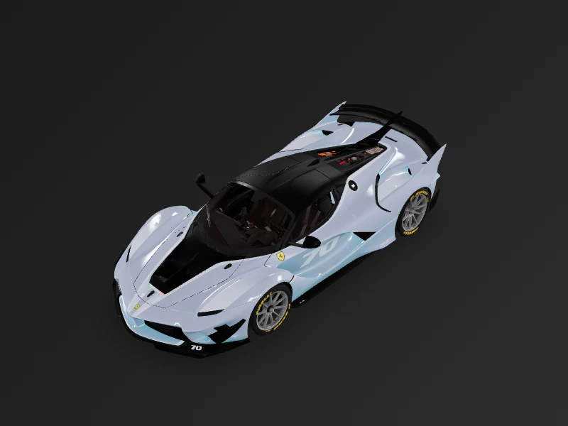
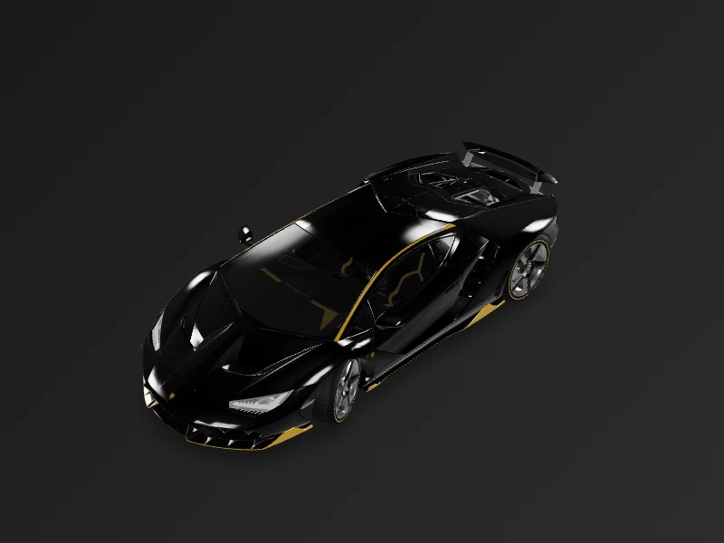
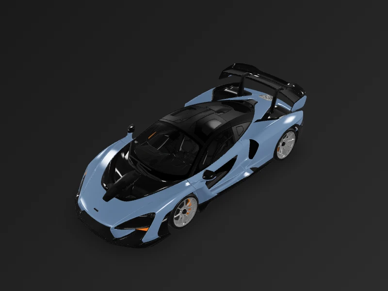
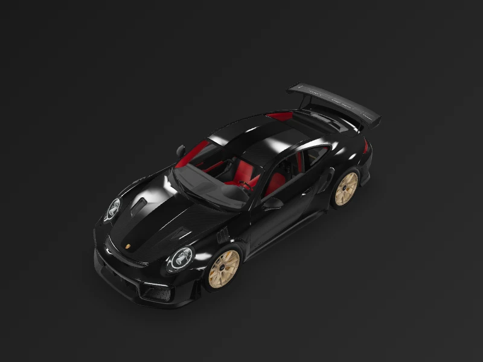

# 🏎️ UI Animated V1 - Show Car

<div align="center">


**Showcase de carros esportivos com visualização 3D, AR e animações avançadas**

[Ver Projeto](./show_car) • [Documentação Completa](./show_car/README.md)

</div>

---

## 🚗 Preview

<table>
<tr>
<td align="center">

<br/><sub><b>Ferrari FXX-K Evo</b></sub>
</td>
<td align="center">

<br/><sub><b>Lamborghini Centenario</b></sub>
</td>
<td align="center">

<br/><sub><b>McLaren Senna</b></sub>
</td>
<td align="center">

<br/><sub><b>Porsche 911 GT2 RS</b></sub>
</td>
</tr>
</table>

---

## ✨ Destaques

| Feature | Descrição |
|---------|-----------|
| 🎨 **Glassmorphism** | Design moderno com efeitos de vidro |
| 🔄 **3D Viewer** | Modelos GLB interativos |
| 📱 **AR** | Realidade Aumentada |
| 🎬 **Animações** | `flutter_animate` + `CustomPainter` |
| 🏁 **Nürburgring** | Pista animada com path metrics |

---

## 🏢 Marcas Incluídas

<div align="center">


</div>

---

## 🚀 Quick Start

```bash
cd show_car
flutter pub get
flutter run
```

---

<div align="center">

**[📖 Ver documentação completa →](./show_car/README.md)**

</div>
