# 🏎️ Show Car

> **Aplicativo Flutter de showcase de carros esportivos com visualização 3D, animações avançadas e design glassmorphism.**

<div align="center">


</div>

---

## ✨ Features

- 🎨 **Design Glassmorphism** - Interface moderna com efeitos de vidro e blur
- 🔄 **Visualização 3D** - Modelos GLB interativos com rotação e zoom
- 📱 **Realidade Aumentada** - Visualize os carros no mundo real (AR)
- 🎬 **Animações Fluidas** - Transições suaves com `flutter_animate`
- 🏁 **Pista de Nürburgring Animada** - CustomPainter com carro percorrendo o circuito
- 🖼️ **Cache de Imagens** - Pré-carregamento otimizado de assets
- 🎠 **Carrossel de Serviços** - Seção interativa de serviços disponíveis

---

## 🚗 Carros Disponíveis

### Supercars & Track Cars

<table>
<tr>
<td align="center" width="33%">

<br/><b>Ferrari FXX-K Evo</b>
<br/>1050hp • V12 Hybrid • 2.4s
</td>
<td align="center" width="33%">

<br/><b>Lamborghini Centenario</b>
<br/>770hp • V12 • 2.8s
</td>
<td align="center" width="33%">

<br/><b>McLaren Senna</b>
<br/>800hp • V8 Twin Turbo • 2.8s
</td>
</tr>
</table>

### German Engineering

<table>
<tr>
<td align="center" width="33%">
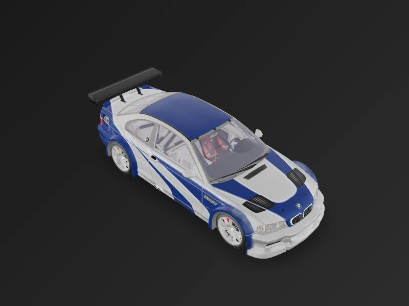
<br/><b>BMW M3 GTR E46</b>
<br/>444hp • I6 Twin Turbo • 3.8s
</td>
<td align="center" width="33%">
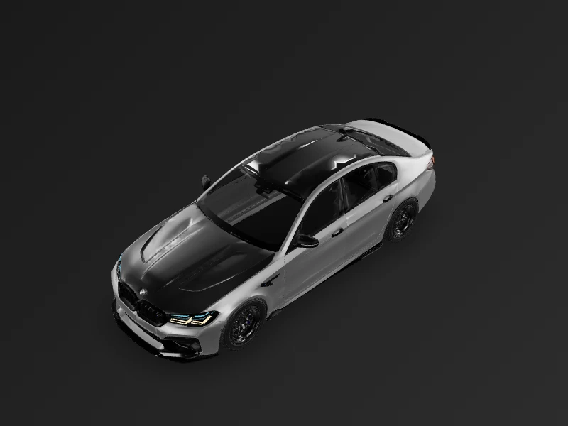
<br/><b>BMW M5 F90</b>
<br/>600hp • V8 Twin Turbo • 3.4s
</td>
<td align="center" width="33%">

<br/><b>Porsche 911 GT2 RS</b>
<br/>700hp • H6 Twin Turbo • 2.7s
</td>
</tr>
</table>

### JDM Legends

<table>
<tr>
<td align="center" width="25%">
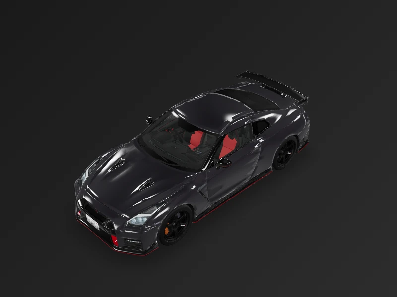
<br/><b>Nissan GT-R R35 NISMO</b>
<br/>600hp • V6 Twin Turbo
</td>
<td align="center" width="25%">
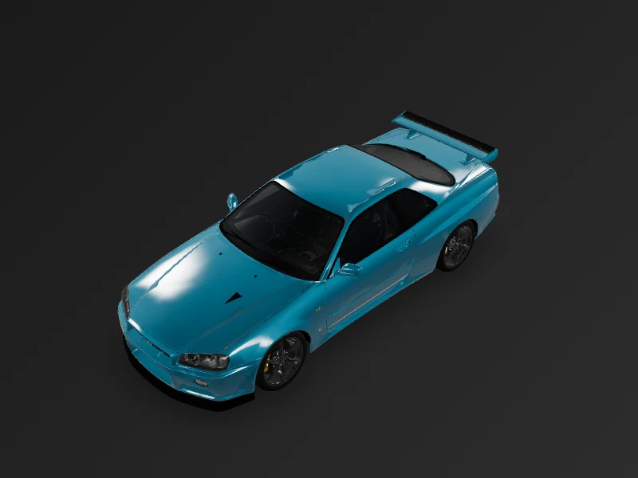
<br/><b>Nissan Skyline R34 GT-R</b>
<br/>280hp • I6 Twin Turbo
</td>
<td align="center" width="25%">
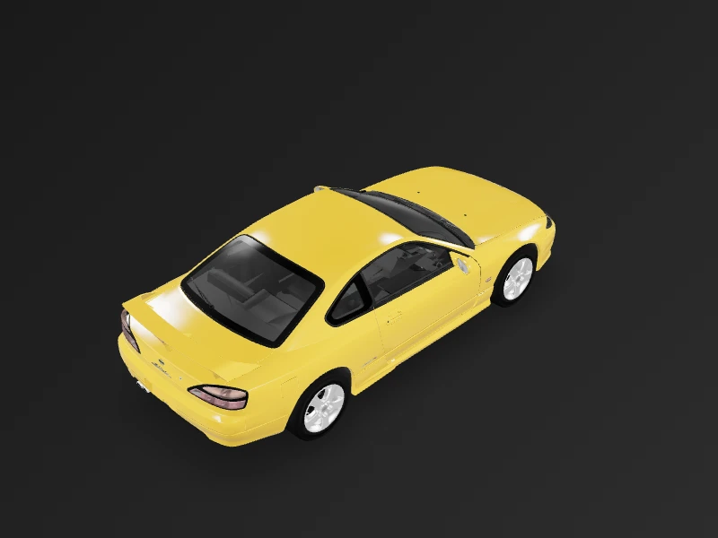
<br/><b>Nissan Silvia S15</b>
<br/>250hp • I4 Turbo
</td>
<td align="center" width="25%">
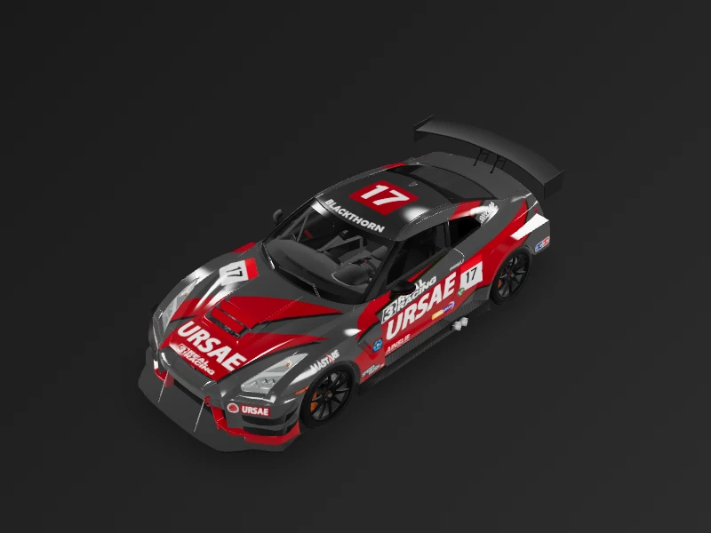
<br/><b>GT-R NISMO R3 (Race)</b>
<br/>600hp • V6 Twin Turbo
</td>
</tr>
</table>

### American Muscle

<table>
<tr>
<td align="center" width="50%">
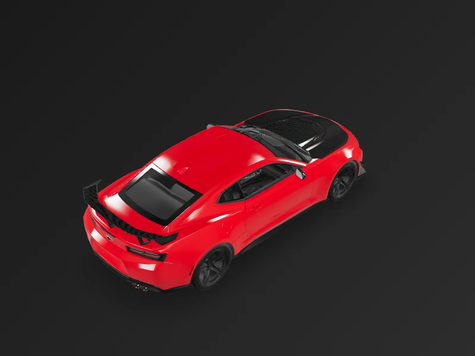
<br/><b>Chevrolet Camaro ZL1 1LE</b>
<br/>650hp • V8 Supercharged • 3.5s
</td>
<td align="center" width="50%">
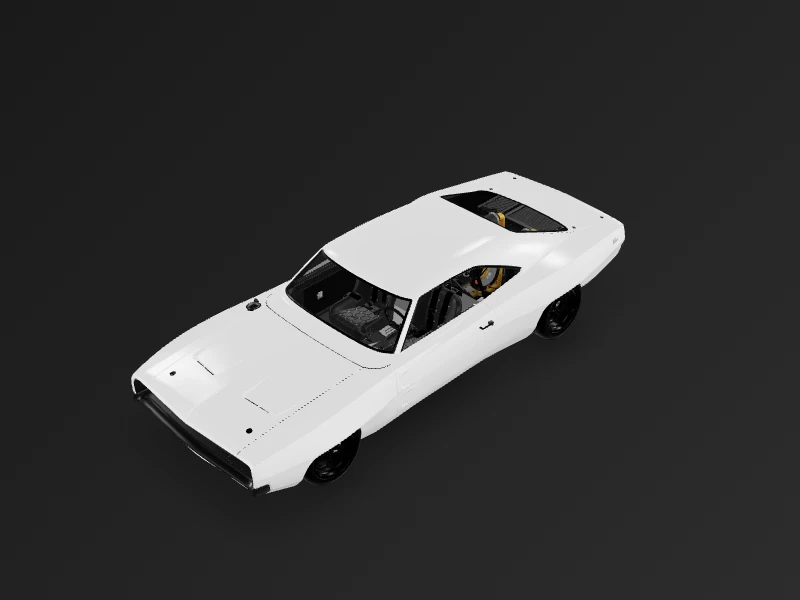
<br/><b>Dodge Charger Hellacious</b>
<br/>1000hp • V8 Supercharged • 3.0s
</td>
</tr>
</table>

---

## 🏢 Marcas

<div align="center">

| | | | | | | | | |
|:---:|:---:|:---:|:---:|:---:|:---:|:---:|:---:|:---:|
|  |  |  |  |  |  |  |  |  |
| BMW | Chevrolet | Dodge | Ferrari | Lamborghini | McLaren | Nissan | GT-R | Porsche |

</div>

---

## 🛠️ Serviços Disponíveis

<table>
<tr>
<td align="center">

<br/><b>Power</b>
</td>
<td align="center">

<br/><b>ECU</b>
</td>
<td align="center">

<br/><b>Remap</b>
</td>
<td align="center">
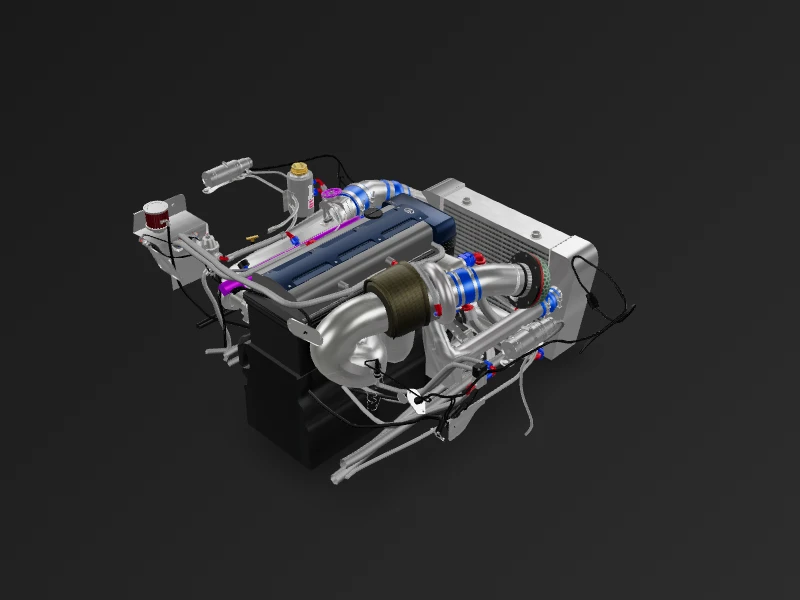
<br/><b>Engine</b>
</td>
<td align="center">
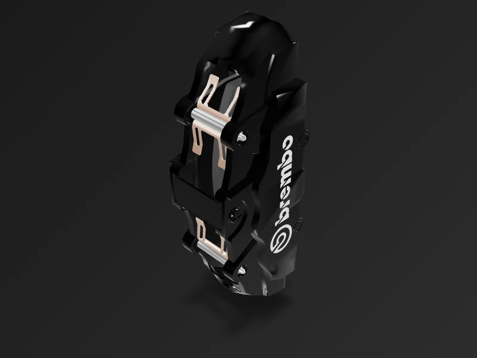
<br/><b>Brake</b>
</td>
<td align="center">
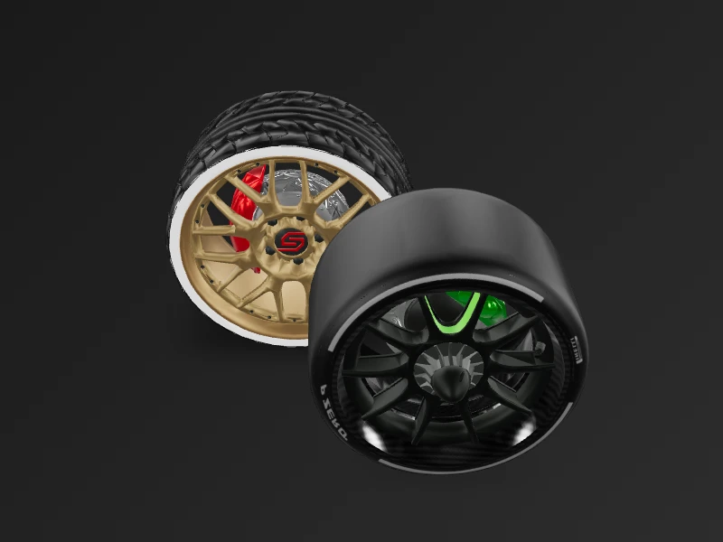
<br/><b>Tires</b>
</td>
</tr>
</table>

---

## 🎨 Técnicas de Animação Utilizadas

| Técnica | Nível | Descrição |
|---------|-------|-----------|
| `AnimatedSize` | Básico | Transições suaves de tamanho |
| `Hero` | Básico | Transições compartilhadas entre páginas |
| `flutter_animate` | Intermediário | Animações declarativas encadeadas |
| `AnimationController` + `Tween` | Avançado | Animações controladas programaticamente |
| `CustomPainter` + `PathMetrics` | Expert | Desenho de pista com carro animado seguindo o path |
| `BackdropFilter` + `ImageFilter.blur` | Intermediário | Efeito glassmorphism |

---

## 📦 Dependências

```yaml
dependencies:
  model_viewer_plus: ^1.10.0    # Visualização 3D e AR
  flutter_3d_controller: ^2.3.0 # Controle adicional de modelos 3D
  flutter_animate: ^4.5.2       # Animações declarativas
  carousel_slider: ^5.1.2       # Carrossel de serviços
  google_fonts: ^6.2.1          # Tipografia premium
  shimmer: ^3.0.0               # Loading elegante
```

---

## 🚀 Como Executar

```bash
# Clone o repositório
git clone https://github.com/DanielBrown1998/ui_animated_v1.git

# Entre no diretório
cd ui_animated_v1/show_car

# Instale as dependências
flutter pub get

# Execute o app
flutter run
```

### Build Release (Android)

```bash
flutter clean
flutter build apk --release
```

> **Nota:** O app requer permissão de internet para o visualizador 3D funcionar em modo release.

---

## 📁 Estrutura do Projeto

```
show_car/
├── lib/
│   ├── main.dart                  # Entry point
│   ├── components/
│   │   ├── brand_colors.dart      # Cores por marca
│   │   ├── cached_car_image.dart  # Cache de imagens com fade
│   │   ├── garage_text.dart       # Tipografia customizada
│   │   ├── glass_card.dart        # Cards glassmorphism
│   │   ├── logo_marca.dart        # Logos das marcas
│   │   ├── nurburgring_painter.dart # Pista animada
│   │   └── service_card.dart      # Cards de serviços
│   ├── models/
│   │   └── car.dart               # Modelo de dados
│   ├── services/
│   │   └── asset_preloader.dart   # Pré-carregamento de assets
│   └── ui/
│       ├── home.dart              # Tela principal
│       ├── car_page.dart          # Detalhes do carro
│       └── splash_screen.dart     # Splash com loading
├── assets/
│   ├── glb/                       # Modelos 3D
│   ├── icon/                      # Logos das marcas
│   ├── images/                    # Imagens de fundo
│   ├── services/                  # Ícones de serviços
│   └── thumbnails/                # Thumbnails dos carros
└── pubspec.yaml
```

---

## 📄 Licença

Este projeto está sob a licença MIT. Veja o arquivo [LICENSE](LICENSE) para mais detalhes.

---

<div align="center">

**Desenvolvido com 💙 e Flutter**

</div>
